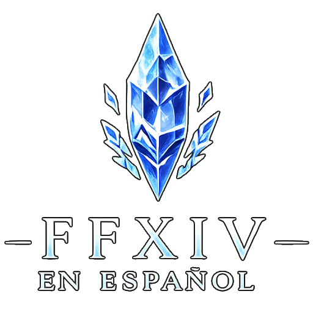

# FFXIVSpanish Patcher

<p align="center">
  
</p>

Parcheador de español para **Final Fantasy XIV**.

Web del proyecto: <https://ffxivspanish.carrd.co/>

Esta aplicación genera un mod `.pmp` para Penumbra usando los archivos de tu propia instalación del
juego. No modifica los archivos originales de FFXIV y no incluye archivos del juego: extrae solo los
datos necesarios, aplica las traducciones incluidas en el programa y crea un paquete listo para
instalar.

La traducción todavía está en progreso. Gran parte de la interfaz, nombres de personajes, NPC,
monstruos, objetos y textos del sistema ya está traducida, pero parte del guion, conversaciones y
prosa narrativa puede seguir en inglés.

## Descargar

Ve a la página de **Releases** del proyecto y descarga el ZIP de tu sistema:

- `FFXIVSpanishPatcher-...-win-x64.zip` para Windows.
- `FFXIVSpanishPatcher-...-linux-x64.zip` para Linux.
- `FFXIVSpanishPatcher-...-osx-arm64.zip` para macOS (Apple Silicon).

Descomprime el ZIP y ejecuta `FFXIVSpanishPatcher`.

No hace falta instalar .NET ni ningún runtime aparte: el programa viene empaquetado como ejecutable
autónomo.

## Requisitos

- Final Fantasy XIV instalado.
- Penumbra instalado y funcionando en Dalamud.
- Una versión del juego compatible con la release descargada.

Cada release del parcheador se construye para una versión concreta de FFXIV. La aplicación muestra
esa versión recomendada al arrancar y la compara con la versión de tu instalación; si no coinciden,
puede generar textos rotos o cierres del juego aunque el mod llegue a crearse.

Si el juego acaba de actualizarse, lo recomendable es quitar el mod de Penumbra y esperar una release
nueva del parcheador, o en su defecto, recrear el mod a partir de los nuevos ficheros postparche. 
FFXIV cambia archivos internos en cada parche y un paquete generado para una versión antigua puede provocar 
textos rotos o cierres del juego.

## Crear el mod

1. Abre `FFXIVSpanishPatcher`.
2. Si detecta la instalación de FFXIV, la ruta aparecerá automáticamente.
3. Si no la detecta, pulsa **Examinar** y selecciona la carpeta del juego.
4. Elige las categorías que quieras traducir. Puedes dejar todo marcado si no tienes una preferencia
   concreta.
5. Pulsa **Generar mod**.
6. Cuando termine, abre la carpeta de salida desde la propia aplicación.

El archivo generado tendrá un nombre parecido a:

```text
FFXIVSpanish-2026-06-24_18-30-00.pmp
```

Por defecto se guarda en:

```text
Documentos/FFXIVSpanish Patcher/Output
```

## Instalar en Penumbra

1. Abre Penumbra dentro del juego.
2. Importa el `.pmp` generado por el parcheador.
3. Activa el mod.
4. En los ajustes de Dalamud, marca **Wait for plugins before game loads**. Si no se hace este paso los textos no se cargarán adecuadamente.
5. Reinicia el juego.

Ese ajuste es importante: si Dalamud carga tarde, Penumbra puede no aplicar el mod a tiempo y verás
el juego sin traducir.

## Actualizar o quitar el mod

Cuando salga una release nueva:

1. Descarga el nuevo parcheador.
2. Genera un `.pmp` nuevo.
3. Quita o desactiva el paquete anterior en Penumbra.
4. Importa y activa el paquete nuevo.

Después de un parche oficial de FFXIV, desactiva el mod antiguo hasta que haya una versión nueva de
este proyecto.

## Qué se traduce

La aplicación permite activar o desactivar bloques de traducción:

- Misiones.
- Nombres de NPC, enemigos, lugares y términos del mundo.
- Clases y jobs.
- Objetos.
- Objetos de evento.
- Coleccionables.
- Acciones, habilidades, rasgos y estados.
- Logros.
- Registro de combate y mensajes del sistema.
- Interfaz.

Algunos textos pueden seguir en inglés aunque la categoría esté marcada. Eso suele significar que esa
parte aún no está traducida o que el juego cambió el dato en un parche reciente.

## Avisar de errores

Si encuentras bugs, textos mal colocados, traducciones raras o inconsistencias, puedes enviarlo aquí:

https://tally.so/r/1ARKzp

Lo más útil es incluir:

- Captura del texto.
- Zona, misión, NPC, objeto o menú donde aparece.
- Qué esperabas ver.
- Versión del juego y versión del parcheador.

## Seguridad y límites

- El parcheador no toca los archivos originales del juego.
- El `.pmp` se instala como cualquier otro mod de Penumbra.
- No se redistribuyen archivos de Square Enix.
- El proyecto no está afiliado a Square Enix.
- Usar mods en FFXIV depende de herramientas externas y queda bajo tu responsabilidad.

Lee también `NOTICE.md` para los avisos legales completos. Si quieres contribuir código,
documentación o traducciones, revisa `CONTRIBUTING.md`; las contribuciones asistidas por IA se rigen
además por `AI_USAGE.md`.

## Compilar desde código

Para desarrollo necesitas el SDK indicado en `global.json`.

```powershell
dotnet build
dotnet test
```

Para publicar un ejecutable autónomo de Windows:

```powershell
dotnet publish src/FFXIVSpanishPatcher.App/FFXIVSpanishPatcher.App.csproj -c Release -r win-x64 `
  --self-contained -p:PublishSingleFile=true -p:IncludeNativeLibrariesForSelfExtract=true
```

El diseño técnico y las decisiones internas están en `docs/DESIGN.md`.
