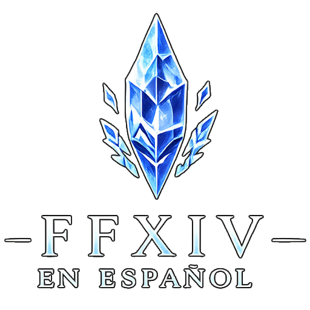

# FFXIVSpanish Patcher

<p align="center">
  
</p>

Parcheador de español para **Final Fantasy XIV**.

Web del proyecto: <https://ffxivspanish.carrd.co/>

Esta aplicación genera un mod `.pmp` para Penumbra usando los archivos de tu propia instalación del
juego. No modifica los archivos originales de FFXIV y no incluye archivos del juego: extrae solo los
datos necesarios, aplica las traducciones incluidas en el programa y crea un paquete listo para
instalar.

La traducción todavía está en progreso. Gran parte de la interfaz, nombres de personajes, NPC,
monstruos, objetos y textos del sistema ya está traducida, pero parte del guion, conversaciones y
prosa narrativa puede seguir en inglés.

## Avance del proyecto

Datos del seguimiento EXD actual. El porcentaje principal mide líneas traducidas reales sobre líneas
traducibles exactas.

| Métrica | Valor | Avance |
| --- | ---: | --- |
| Avance total por líneas | 516.881/808.997 (63,9%) |  |
| Hojas OK | 2.945/6.986 (42,2%) |  |

El desglose por expansión agrupa misiones, cinemáticas y conversaciones con NPC. La interfaz, los
objetos, el combate, los sistemas y el contenido narrativo que abarca varias expansiones se reúnen
en **Elementos comunes**, sin contarlos de nuevo en cada expansión.

| Icono | Contenido | Líneas traducidas | Avance |
| :---: | --- | ---: | --- |
|  | **A Realm Reborn** | 38.906/38.906 (100,0%) |  |
|  | **Heavensward** | 4.781/25.311 (18,9%) |  |
|  | **Stormblood** | 2/31.692 (0,0%) |  |
|  | **Shadowbringers** | 28/44.274 (0,1%) |  |
|  | **Endwalker** | 21/47.170 (0,0%) |  |
|  | **Dawntrail** | 1.174/41.536 (2,8%) |  |
|  | **Evercold** | — (progreso desconocido) |  |
| — | **Elementos comunes** | 471.969/580.108 (81,4%) |  |

Evercold todavía no se ha publicado. Se muestra al 0 % hasta que exista contenido con el que medir
su progreso real.

## Descargar

Ve a la página de **Releases** del proyecto y descarga el ZIP de tu sistema:

- `FFXIVSpanishPatcher-...-win-x64.zip` para Windows.
- `FFXIVSpanishPatcher-...-linux-x64.zip` para Linux.
- `FFXIVSpanishPatcher-...-osx-arm64.zip` para macOS (Apple Silicon).

Descomprime el ZIP y ejecuta `FFXIVSpanishPatcher`.

No hace falta instalar .NET ni ningún runtime aparte: el programa viene empaquetado como ejecutable
autónomo.

### Verificar descarga

Cada ZIP publicado incluye un fichero `*.zip.sha256` con su hash SHA-256. Descarga ambos ficheros
en la misma carpeta y comprueba que coinciden:

```powershell
# Windows PowerShell
Get-FileHash .\FFXIVSpanishPatcher-...-win-x64.zip -Algorithm SHA256
```

```bash
# Linux
sha256sum -c FFXIVSpanishPatcher-...-linux-x64.zip.sha256

# macOS
shasum -a 256 -c FFXIVSpanishPatcher-...-<plataforma>.zip.sha256
```

En Windows, compara el resultado con el hash del fichero `.sha256` de la misma release. Las builds
Windows también llevan una firma autofirmada de FFXIVSpanish Patcher: permite detectar alteraciones,
pero no sustituye un certificado emitido por una CA. Usa el SHA-256 como verificación principal.

## Requisitos

- Final Fantasy XIV instalado.
- Penumbra instalado y funcionando en Dalamud.
- Una instalación legible de FFXIV. La versión recomendada ofrece la cobertura más completa.

Cada release se prepara para una versión concreta de FFXIV. La aplicación muestra esa referencia y
la compara con la instalación seleccionada. Si son diferentes, no decide cuál es más antigua ni
bloquea la prueba: muestra un aviso y pide confirmación antes de aplicar un parcheo *best effort*.

En ese modo, las hojas, páginas y líneas que no existan se omiten y se contabilizan. Si queda
contenido válido, el resultado aparece como **Mod verificado con omisiones**; si no puede aplicarse
nada, no se crea un paquete vacío. Consulta la consola para conocer la cobertura exacta.

## Crear el mod

1. Abre `FFXIVSpanishPatcher`.
2. Si detecta la instalación de FFXIV, la ruta aparecerá automáticamente.
3. Si no la detecta, pulsa **Examinar** y selecciona la carpeta del juego.
4. Abre **Opciones avanzadas y categorías** si no quieres incluirlo todo. Debe quedar al menos una
   categoría marcada.
5. Pulsa **Crear traducción para Penumbra**.
6. Si la versión difiere, revisa el aviso y decide si quieres generar *best effort*.
7. Cuando termine, abre la carpeta de salida desde la propia aplicación.

La integridad se comprueba siempre antes de publicar el fichero. Un error de verificación deja el
paquete anterior intacto y se refleja tanto en el resultado como en la consola.

El archivo generado tendrá un nombre parecido a:

```text
FFXIVSpanish-2026-06-24_18-30-00.pmp
```

Por defecto se guarda en:

```text
Documentos/FFXIVSpanish Patcher/Output
```

## Instalar en Penumbra

1. Abre Penumbra dentro del juego.
2. Importa el `.pmp` generado por el parcheador.
3. Activa el mod.
4. En los ajustes de Dalamud, activa **Wait for plugins before game loads**.
5. Reinicia el juego.

Ese ajuste es importante: si Dalamud carga tarde, Penumbra puede no aplicar el mod a tiempo y verás
el juego sin traducir. Cuando puede localizar Dalamud y Penumbra, el patcher comprueba este ajuste. Si
está desactivado, ofrece activarlo y explica exactamente qué propiedad modificará. Si la detección o
la escritura fallan, continúa sin mostrar errores relacionados con herramientas externas.

## Actualizar o quitar el mod

Cuando salga una release nueva:

1. Descarga el nuevo parcheador.
2. Genera un `.pmp` nuevo.
3. Quita o desactiva el paquete anterior en Penumbra.
4. Importa y activa el paquete nuevo.

Después de un parche oficial de FFXIV, desactiva el mod antiguo hasta que haya una versión nueva de
este proyecto.

## Solución de problemas (Troubleshooting)

### El juego se cierra en ciertos momentos

Asegúrate de haber creado el mod con la última versión disponible del parcheador y con una versión
compatible de Final Fantasy XIV. Si ya tenías un paquete anterior instalado, quítalo de Penumbra,
genera un `.pmp` nuevo e instala ese paquete nuevo.

Si sigue pasando, desinstala o desactiva el mod y envía una incidencia desde este formulario:

https://tally.so/r/1ARKzp

Incluye, si puedes, cuándo ocurre el cierre, qué estabas haciendo, la versión del juego, la versión
del parcheador y si el problema desaparece al desactivar el mod.

### Hay errores de traducción, textos solapados o partes en inglés

La traducción sigue en progreso y puede haber textos con errores, mala colocación, mezcla de español
e inglés o calidad irregular. Puedes ayudar enviando feedback desde este formulario:

https://tally.so/r/1ARKzp

Una captura y el lugar exacto donde aparece el texto ayudan mucho.

### He cargado el mod en Penumbra pero no veo cambios

En los ajustes de Dalamud, marca **Wait for plugins before game loads** y reinicia el juego. En
Penumbra, comprueba también que el paquete esté instalado, activo y habilitado para el personaje o
colección que estás usando.

Si no se hacen estos pasos, Penumbra puede cargar tarde y los textos no se aplicarán.

### El resultado dice «verificado con omisiones»

El paquete se ha comprobado y es utilizable, pero algunas traducciones seleccionadas no existían o
no pudieron aplicarse a la versión instalada. La consola separa `misses`, hojas, páginas y filas
omitidas. Generar con la versión recomendada suele ofrecer la cobertura más completa.

### Copiar varias líneas de la consola

La consola es una única superficie seleccionable: arrastra el ratón a través de todas las líneas que
necesites o usa **Seleccionar todo** / `Ctrl+A`, y copia con `Ctrl+C` o **Copiar log**.

La consola conserva todas las líneas que emite el pipeline. Su documento es virtualizado: solo se
componen visualmente las líneas visibles, por lo que desplazarse o seleccionar texto no depende del
tamaño total del registro. `--debug` añade diagnóstico interno; no es necesario para ver el detalle
normal de páginas y avisos.

### Mis macros han dejado de funcionar

Es un fallo conocido. Suele pasar cuando una macro invoca acciones por su nombre en inglés. Al
aplicar la traducción, los nombres de esas acciones pasan a estar en español.

Puedes traducir los nombres de las acciones dentro de tus macros o generar el mod sin aplicar la
categoría de acciones, habilidades, rasgos y estados.

## Qué se traduce

La aplicación permite activar o desactivar bloques de traducción:

- Misiones.
- Nombres de NPC, enemigos, lugares y términos del mundo.
- Clases y jobs.
- Objetos.
- Objetos de evento.
- Coleccionables.
- Acciones, habilidades, rasgos y estados.
- Logros.
- Registro de combate y mensajes del sistema.
- Interfaz.

Algunos textos pueden seguir en inglés aunque la categoría esté marcada. Eso suele significar que esa
parte aún no está traducida o que el juego cambió el dato en un parche reciente.

## Avisar de errores

Si encuentras bugs, textos mal colocados, traducciones raras o inconsistencias, puedes enviarlo aquí:

https://tally.so/r/1ARKzp

Lo más útil es incluir:

- Captura del texto.
- Zona, misión, NPC, objeto o menú donde aparece.
- Qué esperabas ver.
- Versión del juego y versión del parcheador.

## Seguridad y límites

- El parcheador no toca los archivos originales del juego.
- El `.pmp` se instala como cualquier otro mod de Penumbra.
- No se redistribuyen archivos de Square Enix.
- El proyecto no está afiliado a Square Enix.
- Usar mods en FFXIV depende de herramientas externas y queda bajo tu responsabilidad.

Lee también `NOTICE.md` para los avisos legales completos. Si quieres contribuir código,
documentación o traducciones, revisa `CONTRIBUTING.md`; las contribuciones asistidas por IA se rigen
además por `AI_USAGE.md`.

## Compilar desde código

Para desarrollo necesitas el SDK indicado en `global.json`.

```bash
dotnet restore --locked-mode
dotnet build -c Release --no-restore
dotnet test -c Release --no-build
```

Para publicar un ejecutable autónomo de Windows:

```powershell
dotnet publish src/FFXIVSpanishPatcher.App/FFXIVSpanishPatcher.App.csproj -c Release -r win-x64 `
  --self-contained -p:PublishSingleFile=true -p:IncludeNativeLibrariesForSelfExtract=true
```

El diseño técnico está en `docs/DESIGN.md`, la política *best effort* en
`docs/COMPATIBILITY.md`, la edición del historial en `docs/TRANSLATION_MILESTONES.md` y la
validación de releases en `docs/RELEASE_CHECKLIST.md`.
